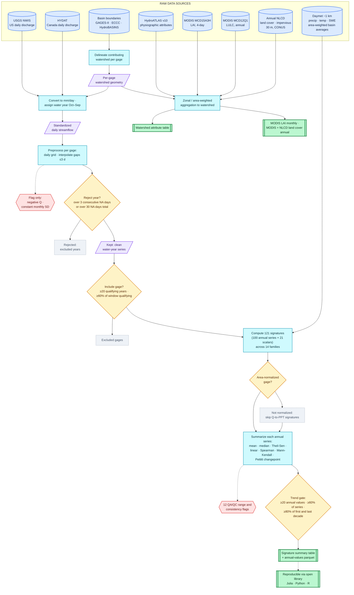

# HISSS Dataset Workflow Schematic

Workflow figure for the HISSS manuscript (§2 Methods) — from raw sources through
QA screening, signature extraction, and watershed aggregation to the five
HydroShare resources' core tables. GitHub renders the diagram below natively.

- **Corrected 2026-09-01** (from the draft schematic): 121 signatures
  (100 annual series + 21 scalars) across **14** families (was "~100 across 13");
  trend gate stated as ≥20 values / **≥60% of series** / ≥80% of first and last
  decade (was "≥80% of series and each decade"); **Annual NLCD** added as a raw
  source and to the land-cover output table; Daymet source noted as pre-computed
  area-weighted basin averages; "gauge" → "gage" (USGS convention); the open
  library linked as "reproducible via" rather than a downstream consumer.
- **GitHub rendering note (2026-09-01)**: "Unable to render rich display" on this
  file was NOT caused by this source. Verified directly: the diagram renders
  cleanly under stock mermaid 10.9.3, 11.12.0, AND 11.17.2 — GitHub's exact
  pinned version, extracted from its live viewscreen bundle — in strict security
  mode. GitHub's production bundle
  (`viewscreen.githubusercontent.com/static/assets/mermaidMarkdown-7fad2455….js`)
  currently crashes during its own bootstrap (TypeError in its octicons module
  init, before mermaid ever runs), reproduced on GitHub's own public mermaid
  README where ALL diagrams fail with the identical symptom — a platform-wide
  outage; re-check after GitHub ships a fixed bundle (hard refresh, the old
  bundle may be cached). The source is nonetheless kept directive-free and
  edge-label-free as the maximally compatible form (an earlier GitHub-pinned
  mermaid had a dagre bug with `%%{init}%%` + labeled edges,
  mermaid-js/mermaid#6452 / #6022); branch outcomes live in node text instead
  ("Rejected:", "Kept:", "Not normalized:").
- **PNG render**: `dataset_workflow_schematic.png` (same folder, 3× resolution,
  white ground) — regenerate with `render_mermaid.py` (same folder; needs a venv
  with `playwright` + `playwright install chromium`, plus `mermaid.min.js`
  downloaded beside the script — cdnjs mermaid 10.9.3 UMD):
  `python render_mermaid.py <in.mmd> <out.png> 3`. The theme/spacing/curve config
  the init directive used to carry is injected by the renderer via
  `mermaid.initialize()`, so the PNG keeps the styled look. The script also works
  around two headless-shell quirks: mermaid's font CSS never reaches the
  foreignObject labels (falls back to Times), and the SVG collapses to container
  width unless pinned to its viewBox size.
- This folder (`docs/plans/`) is excluded from the public CZ-Sync/HISSS mirror,
  so the figure stays private until the manuscript ships.

