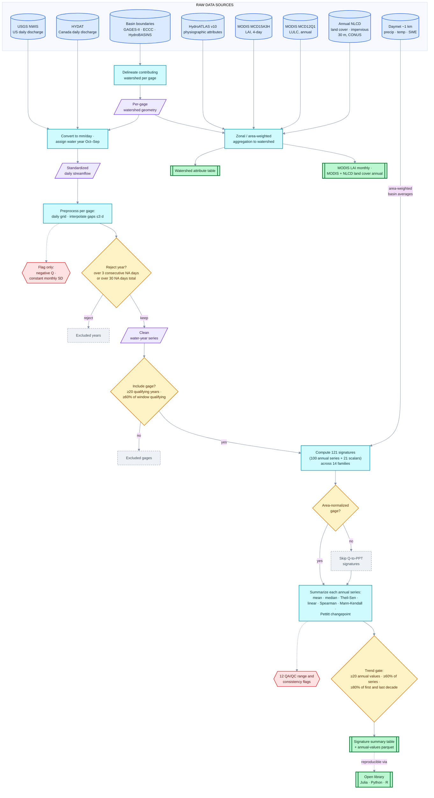

# HISSS Dataset Workflow Schematic

Workflow figure for the HISSS manuscript (§2 Methods) — from raw sources through
QA screening, signature extraction, and watershed aggregation to the five
HydroShare resources' core tables. GitHub renders the diagram below natively.

- **Corrected 2026-09-01** (from the draft schematic): 121 signatures
  (100 annual series + 21 scalars) across **14** families (was "~100 across 13");
  trend gate stated as ≥20 values / **≥60% of series** / ≥80% of first and last
  decade (was "≥80% of series and each decade"); **Annual NLCD** added as a raw
  source and to the land-cover output table; Daymet edge labeled as pre-computed
  area-weighted basin averages; "gauge" → "gage" (USGS convention); the open
  library is linked as "reproducible via" rather than a downstream consumer.
- **PNG render**: `dataset_workflow_schematic.png` (same folder, 3× resolution,
  white ground) — regenerate with the Playwright/Chromium mermaid renderer
  (scratchpad tool `render_mermaid.py`; any mermaid-cli works too).
- This folder (`docs/plans/`) is excluded from the public CZ-Sync/HISSS mirror,
  so the figure stays private until the manuscript ships.

